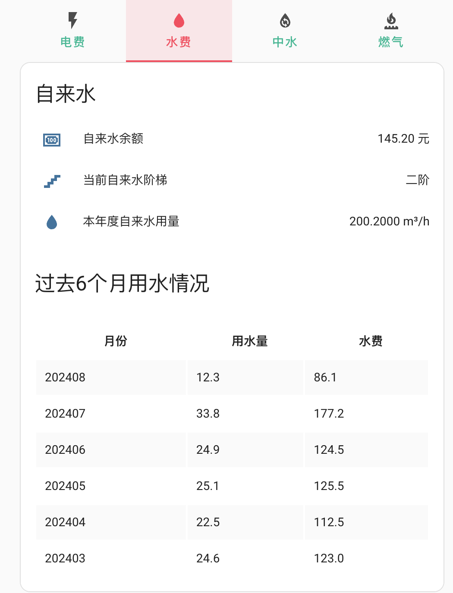
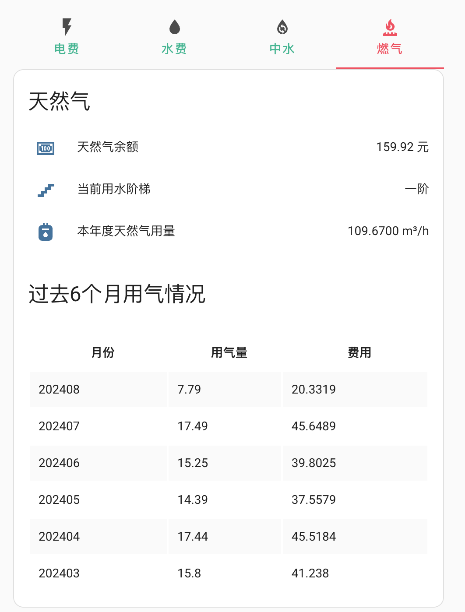

# 北京顺义自来水天然气信息查询

通过“顺义市政控股综合服务平台”微信公众号的接口，采集你的家庭自来水、天然气信息。

## 功能

- [x] 支持查询户号下的水表和天然气费用
- [x] 支持查询最近六个月的消费信息
- [x] 支持UI配置
- [x] 支持热重载组件

## 先决条件
1. 关注“顺义市政控股综合服务平台”微信公众号，绑定户号，可以查询到你的自来水、天然气信息
2. 安装 Home Assistant,当前版本 2023.8
3. 能够抓包，获得openid和户号

## 抓包需要的参数
必须抓包，获取cuOpenId、customerCode两个参数。
cuOpenId 是12位数字
customerCode 是 xxxxxx_xxxXX_X 这样格式的token

公众号上操作综合查询，查询当前余额。
从 `https://ys.shunzhengjinfu.com/cis/wechart/$https://ys.shunzhengjinfu.com/cis/wechart/we-chart!`这样的url上可以获得，这些参数。

## 示例卡片

代码参考 [docs/水气费卡片.yaml](docs/水气费卡片.yaml)
把实体中的编号换成你对应的编号就可以

效果图

